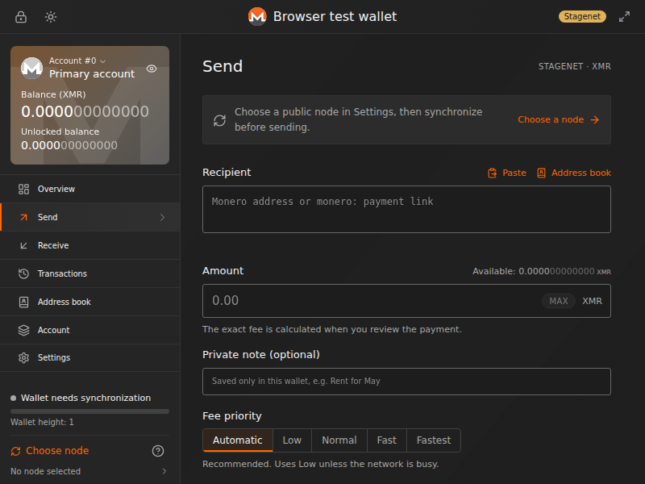

# Monero Wallet 2.3 — Chrome popup

**A real Monero wallet inside the extension. No companion app, no `monero-wallet-rpc`, no local servers and no tab that has to stay open.**

React 19 + TypeScript + Vite + Motion. The interface follows the dark theme of the [Monero GUI](https://www.getmonero.org/downloads/): balance card, side navigation, flat forms, Roboto and orange indicators. The layout is adapted to Chrome's **800 × 600** popup limit. There is a light theme, smooth transitions and support for `prefers-reduced-motion`.

This is an **independent project, not an official release of the Monero Project**. Visual similarity does not imply endorsement or a formal audit. Test on stagenet and with small amounts first. Keep your recovery phrase separate from the browser.



## Installation

1. Unzip `release/monero-wallet-extension.zip` into a permanent folder.
2. Open `chrome://extensions`, turn on **Developer mode** and choose **Load unpacked** → the folder that contains `manifest.json`.
3. Clicking the icon opens the **wallet popup**: Account, Send, Receive, Transactions, Settings.
4. **Create a new wallet**, **Restore from recovery phrase** and **Import encrypted wallet** open a **separate onboarding page**. The name, network and password are set there; creating a wallet works offline.
5. For a new wallet, write down all **25 words**, save the encrypted backup and verify the three requested words. Never share your seed or password with anyone.
6. In the popup, open **Settings → Node**, confirm the privacy notice and choose a suitable node → **Use node → Check & save node**.
7. Click **Sync wallet**. The progress is real; sending becomes available only after a fresh, completed synchronization.

Chrome/Chromium 120+. Whether the onboarding page can open the popup automatically depends on the Chrome version; if the button is not available, click the extension icon in the toolbar. An additional large tab is available through the expand icon, but it is **not needed** for the engine to work.

**Updating an existing installation:** make a seed or encrypted backup first. Lock the wallet, replace the files in the **same folder** and click Reload in `chrome://extensions`. Do not remove the extension or change its unpacked path without a backup: that can change the extension ID and its access to storage.

## Popup and lifecycle

- Closing the popup **does not lock the session** and does not interrupt a synchronization that has already started or a confirmed send.
- An unsent review belongs to the window that created it. Closing that window cancels it; another popup cannot confirm someone else's draft.
- **Lock** saves the encrypted data, stops scanning while keeping its progress, and removes keys from memory. A transaction already sent to the node cannot be cancelled.
- Auto-lock turns on after the chosen time without interaction (**5 minutes** by default, 1–60 minutes in Settings). It waits for an operation or synchronization that is already running to finish; it is **not a hard timer that destroys keys in the middle of work**. Ordinary polling does not extend the timer.
- Restarting Chrome, updating the extension or losing the internal offscreen document returns the wallet to the locked state. Unsaved scan progress may require another Sync; saved keys remain encrypted.
- The popup and the large tab share one session. Operations are bound to the specific wallet shown by the interface: a stale window must not reveal the seed or send from another wallet after a switch.

## Architecture

```text
Popup (React) / separate onboarding / optional large tab
    ↕ direct local Chrome runtime.Port, requests are never retried
Offscreen document · WalletService + encrypted IndexedDB vault
    ↕ Dedicated Worker · real Monero WebAssembly
    ↕ direct blockchain RPC
Monero node: public or your own (untrusted)

MV3 service worker: offscreen startup, navigation, safe writing of the recovery marker.
It receives no passwords or seed, stores no keys and performs no wallet operations.
```

[monero-ts 0.11.15](https://github.com/woodser/monero-ts) performs key creation, restoration, scanning and signing **in the browser**. The WASM and all executable code are packaged locally. The node receives blockchain requests and already-signed transactions, **never the password, seed or private keys**.

## Features

- Mainnet / stagenet / testnet; offline creation, opening with a password, restoring a standard 25-word phrase.
- AES-256-GCM + PBKDF2-SHA256 with 600,000 iterations, a fresh salt and IV on every save, IndexedDB, a consistent change of the native and outer passwords, encrypted import and export.
- Balances exact to atomic units, accounts and subaddresses, QR codes and payment URIs, history, notes and CSV.
- **New in 2.2:**
  - "Overview" screen with the balance, locked funds and recent activity;
  - address manager: the balance of each subaddress, an "Unused" tag, renaming, search;
  - address book (stored inside the encrypted wallet);
  - "Max": send the whole unlocked balance with the fee deducted from the amount;
  - pasting `monero:` links;
  - instant offline address check: Keccak checksum, network and address type;
  - message signing and verification;
  - transaction key for proof of payment;
  - "Pending" filter and totals in the history;
  - restore by date;
  - light theme for the setup wizard, keyboard shortcuts Alt+1…7.
- **New in 2.3:**
  - your own node (for example a local `monerod`), stored encrypted inside the wallet; a warning for HTTP nodes;
  - quick one-click subaddress creation and integrated addresses with a payment ID;
  - renaming wallets and accounts, a quick account switcher in the sidebar;
  - the seed phrase and view keys are shown only after the password is entered; the spend key is never shown;
  - an option to confirm payments with the password, and a choice of auto-lock time (1–60 minutes);
  - rescanning the blockchain from a chosen height or date;
  - deleting a wallet from the browser (password plus typing its name).
- Explicit synchronization with real progress; no automatic node access when a wallet is opened.
- Signing without sending → full address, amount, fee, tx ID → a separate confirmation. One-shot drafts; payments are never retried automatically.
- A record of an unknown send outcome that survives restarts. Clearing it requires checking the specific tx ID and is protected against stale windows.
- Remembers the selected account, page, theme and balance-hiding mode. These settings contain **no addresses, amounts, seed or passwords**.
- Smooth page and dialog transitions, loading states, keyboard navigation, focus trap and reduced motion. Balances and progress are never simulated with animation.

The interface is in English. This is not a full port of every desktop GUI feature: **there are no hardware wallets, multisig, Polyseed, OpenAlias, cold signing, per-output sweep-all, mining, RPC login or node proxies**. Non-working decorative buttons for these features were not added.

## Public nodes

| Network | Node | Address |
| --- | --- | --- |
| Mainnet | Cake Wallet | `https://xmr-node.cakewallet.com:18081` |
| Mainnet | Seth for Privacy | `https://node.sethforprivacy.com:443` |
| Mainnet | HashVault | `http://nodes.hashvault.pro:18081` |
| Stagenet | Seth for Privacy | `http://node.sethforprivacy.com:38089` |
| Testnet | Seth for Privacy | `http://node.sethforprivacy.com:28089` |

Catalog and sources: `shared/nodes.json`. Third-party operators may be unavailable, lie about the state of the network or observe your IP address and request timing. **HTTP is not encrypted**. HTTPS does not make a node trusted. There is no automatic fallback, no node health checks and no automatic Sync when a wallet is opened. Check node performs only an explicit `get_info`; the selected node is saved encrypted.

### Your own node

In Settings → Node you can add your own node, for example a local `monerod`: `http://127.0.0.1:18081`.

- **Address:** only `http(s)://host[:port]`, with no path, login or parameters. A DNS name, IPv4 and bracketed IPv6 are accepted.
- **Storage:** the list is stored **encrypted inside that specific wallet**, up to 16 nodes. Other wallets and the lock screen do not see it.
- **Access:** adding a node sends nothing. When you select it, Chrome asks for permission **for that address only**. The wallet then performs `get_info`, checks the network and connects to the node in **untrusted** mode.
- **If the node does not respond:**
  - allow access in Chrome's prompt;
  - check that `monerod` is running with `--restricted-rpc`;
  - access from another device needs `--rpc-bind-ip 0.0.0.0 --confirm-external-bind`.

Your own node is the most private option: no outside operator sees your IP address or your transactions.

This is not a full node, but scanning downloads block data and can take significant time and traffic, especially when restoring from height `0`. If the height of the first incoming payment is unknown, use `0`: a height that is too high can hide funds.

## Backups and unknown send outcomes

Removing the extension, clearing profile data or losing the device can destroy saved wallets. Nobody can recover the password.

- **Settings → Wallet → Export encrypted backup** creates an encrypted JSON file for this extension, not a desktop `.keys` file.
- Import never overwrites existing IDs or names. The file's authenticity and the password are checked on unlock, not when the file is selected.
- After changing the password, export a new backup. Older copies keep the old password.
- If a **send outcome is unknown**, run Sync first and look for the given tx ID in the history. Do not dismiss the warning just to try again. Closing the popup or the browser does not cancel a transaction that was already sent.

## Development and testing

Node.js 22.13+ is needed **only by developers**, not by users of the extension:

```bash
npm ci --include=dev
npm run build               # popup + onboarding + offscreen + local WASM → dist/
npm run package             # extension.zip + source.zip → release/
npm test
npx playwright install chromium
npm run test:ui             # real Chromium MV3 and WASM
npm run test:engine         # strict-CSP proof of the engine
# Optional: a temporary private fakechain, not a component of the product
MONEROD_BIN=/path/to/monerod npm run test:regtest
```

`npm run dev` is a web preview with a local dev worker, not the production transport. Only the installed extension has Chrome host permissions for non-CORS nodes. The native `monerod` is used only by an optional isolated test with fake funds; no 2.x scenario needs `monero-wallet-rpc`.

- `src/App.tsx`, `src/gui.css`, `src/pages`: the main popup.
- `src/Onboarding.tsx`, `src/onboarding.css`: the separate setup wizard.
- `src/runtime/offscreen*`, `transport*`: lifecycle, direct ports and coordination.
- `src/runtime/service.ts`, `vault.ts`, `worker-hooks.ts`: session, encrypted storage, real Monero operations.
- `scripts/build-runtime.mjs`, `build-monero.mjs`: local runtime and WASM bundles.
- `experiments/wasm-mv3`: reproducible engine proofs; not included in the installation ZIP.

Test scope: [TESTING.md](TESTING.md). Security model: [SECURITY.md](SECURITY.md). Monero code and notices are included in the build. The symbol is reproduced from the [official press kit](https://www.getmonero.org/press-kit/); the Monero logo is by the Monero Project and is used under [CC BY-SA 4.0](https://creativecommons.org/licenses/by-sa/4.0/). The name and the mark do not imply endorsement by the project.
